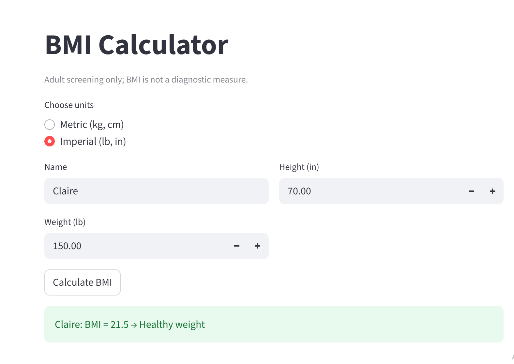

# 🧮 BMI Calculator (Streamlit)

[](https://devipravallikakarry-bmi-calculator-app.streamlit.app/)

A tiny web app that calculates adult Body Mass Index (BMI) from metric or imperial inputs. BMI is a screening tool for adults and not a diagnostic measure.

---

## ✨ Features
- 🔁 Unit toggle: Metric (kg, cm) or Imperial (lb, in)
- ✅ Input validation for positive values
- 📊 Instant BMI with category label

---

## 🖼️ Screenshot


---

## 🚀 Run locally
1) Create and activate a virtual environment (recommended).  
2) Install dependencies:
 ```bash
pip install -r requirements.txt
 ```
4) Start the app:
```bash
streamlit run app.py
```

---

## 📐 Formulas
- Metric: BMI = kg / (m^2)  
- Imperial: BMI = (lb × 703) / (in^2)

---

## 🧭 Adult categories
- Underweight: < 18.5  
- Healthy weight: 18.5–24.9  
- Overweight: 25–29.9  
- Obesity (Class I): 30–34.9  
- Obesity (Class II): 35–39.9  
- Obesity (Class III): ≥ 40

---

## 🗂️ Project structure

```
├── app.py
├── requirements.txt
├── README.md
└── assets/
└── screenshot.png
```
---

## 🛠️ Notes
- Edit `app.py` while the app runs; the browser refreshes on save.
- Keep your virtual environment out of version control via `.gitignore` (e.g., `.venv/`, `venv/`).

## 🙌 Acknowledgments
Built with Streamlit and common adult BMI reference ranges.


